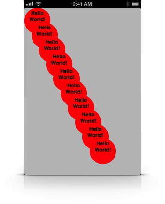

**FKRBlockDrawing** is a collection of two classes and one category to make creating **artwork in code** a lot easier.  
It's great in conjunction with [PaintCode](http://paintcodeapp.com "PaintCode"), where the graphics in the examples project are from.

- - - - -
**Installation:**

Simply drag [FKRBlockDrawing.h](FKRBlockDrawing.h) and [FKRBlockDrawing.m](FKRBlockDrawing.m) into your project and you're done!

- - - - -
**Compatibility:**

*FKRBlockDrawingView* requires iOS 4.0 or later and the QuartzCore framework.  
*FKRBlockDrawing* works with both automatic reference counting (ARC) and manual reference counting.

- - - - -
**Usage:**

*Creating a render block*

```Objective-C
FKRBlockDrawingRenderBlock renderBlock = ^(CGContextRef context, CGSize size) {
    CGRect rect = CGRectMake(0, 0, size.width, size.height);
    
    [[UIColor redColor] set];
    CGContextAddEllipseInRect(context, rect);
    CGContextFillEllipseInRect(context, rect);
    
    [[UIColor blackColor] set];
    [@"Hello World!" drawInRect:CGRectInset(rect, 5, 10) withFont:[UIFont boldSystemFontOfSize:14] lineBreakMode:NSLineBreakByWordWrapping alignment:NSTextAlignmentCenter];
};
```

*FKRBlockDrawingView*

```Objective-C
FKRBlockDrawingView *view = [[FKRBlockDrawingView alloc] initWithFrame:frame renderBlock:renderBlock];
```

*UIImage+FKRBlockDrawing*

```Objective-C
UIImage *image = [UIImage imageWithRenderBlock:renderBlock size:size];
```

*FKRBlockDrawingLayer*

```Objective-C
FKRBlockDrawingLayer *layer = [FKRBlockDrawingLayer layerWithRenderBlock:renderBlock];
```

- - - - -


