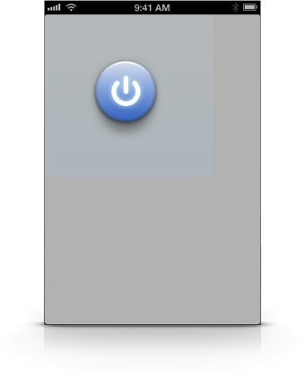

**FKRBlockDrawing** is a collection of two classes and one category to make creating **artwork in code** a lot easier.  
It's great in conjunction with [PaintCode](http://paintcodeapp.com "PaintCode"), where the graphics in the examples project are from.

# Installation

Simply drag [FKRBlockDrawing.h](FKRBlockDrawing.h) and [FKRBlockDrawing.m](FKRBlockDrawing.m) into your project and you're done!

# Compatibility

*FKRBlockDrawingView* requires iOS 4.0 or later and the QuartzCore framework.  
*FKRBlockDrawing* works with both automatic reference counting (ARC) and manual reference counting.

# Usage

*Creating a render block*

```Objective-C
FKRBlockDrawingRenderBlock renderBlock = ^(CGContextRef context, CGSize size) {
    CGRect rect = CGRectMake(0, 0, size.width, size.height);
    
    [[UIColor redColor] set];
    CGContextAddEllipseInRect(context, rect);
    CGContextFillEllipseInRect(context, rect);
    
    [[UIColor blackColor] set];
    [@"Hello World!" drawInRect:CGRectInset(rect, 5, 10) withFont:[UIFont boldSystemFontOfSize:14] lineBreakMode:NSLineBreakByWordWrapping alignment:NSTextAlignmentCenter];
};
```

*FKRBlockDrawingView*

```Objective-C
FKRBlockDrawingView *view = [[FKRBlockDrawingView alloc] initWithFrame:frame renderBlock:renderBlock];
```

*UIImage+FKRBlockDrawing*

```Objective-C
UIImage *image = [UIImage imageWithRenderBlock:renderBlock size:size];
```

*FKRBlockDrawingLayer*

```Objective-C
FKRBlockDrawingLayer *layer = [FKRBlockDrawingLayer layerWithRenderBlock:renderBlock];
```

- - - - -




- - - - -

# License
MIT License

	Copyright (c) 2013 Fabian Kreiser
	
	Permission is hereby granted, free of charge, to any person obtaining a copy of
	this software and associated documentation files (the "Software"), to deal in
	the Software without restriction, including without limitation the rights to use,
	copy, modify, merge, publish, distribute, sublicense, and/or sell copies of the
	Software, and to permit persons to whom the Software is furnished to do so,
	subject to the following conditions:
	
	The above copyright notice and this permission notice shall be included in all
	copies or substantial portions of the Software.
	
	THE SOFTWARE IS PROVIDED "AS IS", WITHOUT WARRANTY OF ANY KIND, EXPRESS OR
	IMPLIED, INCLUDING BUT NOT LIMITED TO THE WARRANTIES OF MERCHANTABILITY, FITNESS
	FOR A PARTICULAR PURPOSE AND NONINFRINGEMENT. IN NO EVENT SHALL THE AUTHORS OR
	COPYRIGHT HOLDERS BE LIABLE FOR ANY CLAIM, DAMAGES OR OTHER LIABILITY, WHETHER
	IN AN ACTION OF CONTRACT, TORT OR OTHERWISE, ARISING FROM, OUT OF OR IN
	CONNECTION WITH THE SOFTWARE OR THE USE OR OTHER DEALINGS IN THE SOFTWARE.